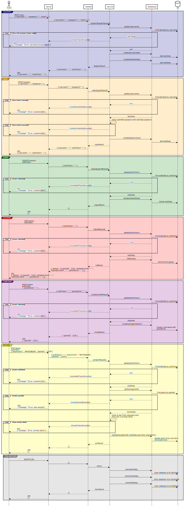

# Project Notes

## 2025.05.05

I finished Phase 0 of the Chess project successfully! I liked it, especially when building multiple classes, and they all work together.

While I scored 100% on the submission, my code quality is only at a 15%. Here are some things I will need to fix:

- Duplicate lines: (action plan: make a class for these type of pieces)
    - QueenMovesCalculator (line 37)
    - RookMovesCalculator (line 49)
    - BishopMovesCalculator (line 48)
- Duplicate block
    - PawnMovesCalculator (lines 97 and 105)
- Delete all old commented out code
- Nesting: maximum is 4
    - PawnMovesCalculator: line 70, 74, 75
- Line Length: maximum is 150 characters
    - ChessMove at line 54

## 2025.05.12

### Phase 1 Special Algorithms

`validMoves`:
1. For every one of these possible moves, create a copy of the chess board with that move made.
   - Loop through all pieces on that board to see if they can capture the king.
     - If any piece can capture the king, it's automatically an invalid move. Return to step 1.
     - If a move is ok, add it to a Collection that stores valid moves.
   - Finish looping through the moves.
2. Return the valid moves.

`isInCheckmate`:
1. Loop through all the pieces of the color in the board.
   - Run validMoves to calculate the moves of each piece
2. If there are no valid moves, then CHECKMATE

## 2025.05.14

Completed Phase 2 of the Chess Project, with the following server design sequence diagram:



## 2025.05.26

Starting on Phase 4 of the project. Here I am designing the database schema with SQL.

### userData

- The primary key should be username. Usernames are unique

```sql
CREATE TABLE IF NOT EXISTS userData (
    username VARCHAR(255) NOT NULL,
    password VARCHAR(255) NOT NULL,
    email VARCHAR(255) NOT NULL,
    PRIMARY KEY (username)
);
```

### authData

- Indexed by authToken
- username is a foreign key from userData

```sql
CREATE TABLE IF NOT EXISTS authData (
    authToken VARCHAR(255) NOT NULL,
    username VARCHAR(255) NOT NULL,
    INDEX (authToken),
    FOREIGN KEY (username) REFERENCES userData(username) ON UPDATE CASCADE ON DELETE RESTRICT
);
```

### gameData

- The game ID should increment automatically. It is a primary key
- whiteUsername and blackUsername can be null. They are foreign keys from userData, set null when deleted

```sql
CREATE TABLE IF NOT EXISTS gameData (
    gameID INT NOT NULL AUTO_INCREMENT,
    whiteUsername VARCHAR(255),
    blackUsername VARCHAR(255),
    gameName VARCHAR(255) NOT NULL,
    game TEXT NOT NULL DEFAULT "insert chess game as JSON here",
    PRIMARY KEY (gameID),
    FOREIGN KEY (whiteUsername) REFERENCES userData(username) ON UPDATE CASCADE ON DELETE SET NULL,
    FOREIGN KEY (blackUsername) REFERENCES userData(username) ON UPDATE CASCADE ON DELETE SET NULL
);
```